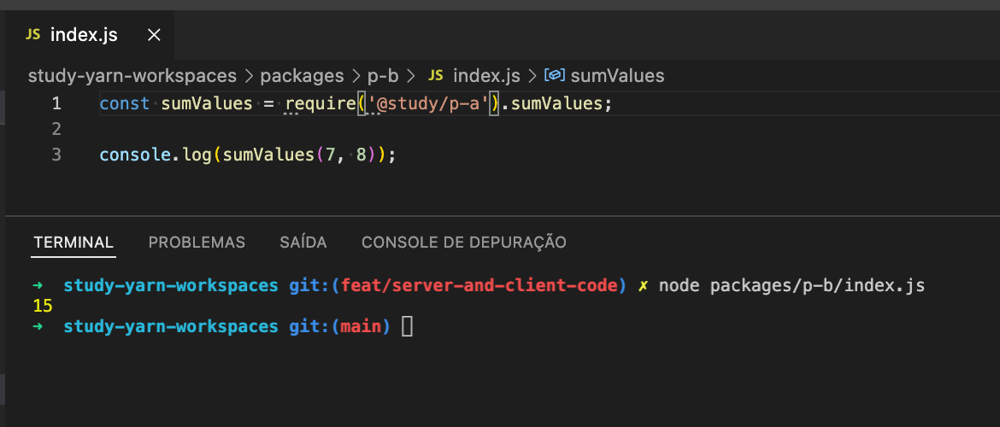

# Caso de Estudo - Yarn Workspaces

Criar módulos (pacotes) separados e utiliza-los usando o yarn, ler mais em: https://classic.yarnpkg.com/lang/en/docs/workspaces/

Comumente utilizado pelo [Babel](https://github.com/babel/babel/tree/main/packages).

